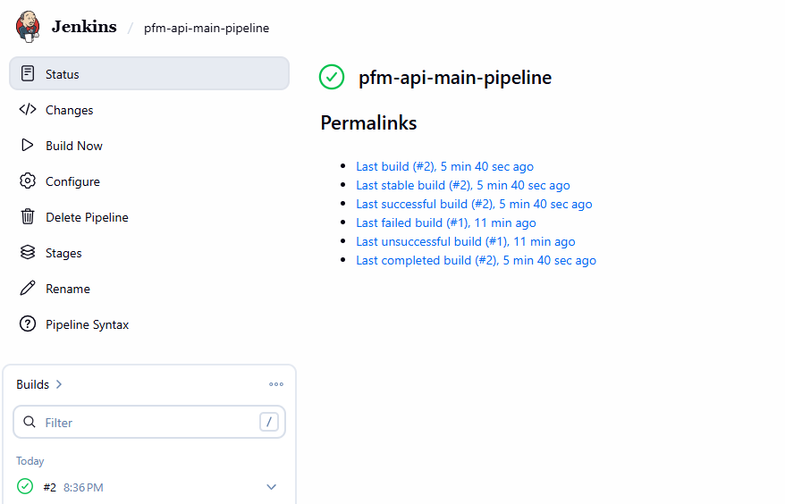
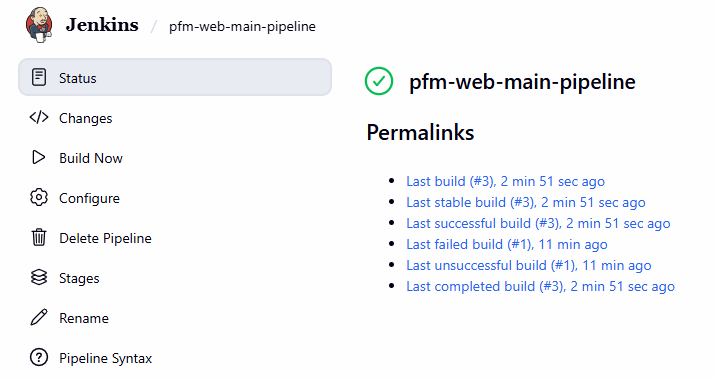
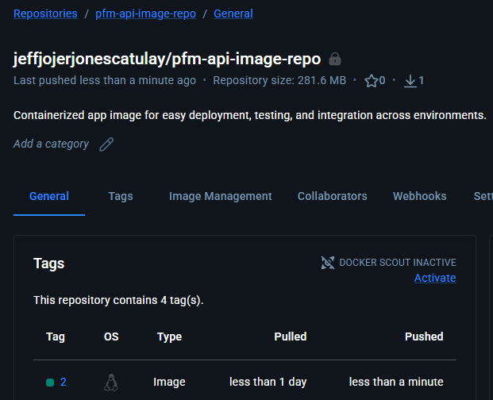
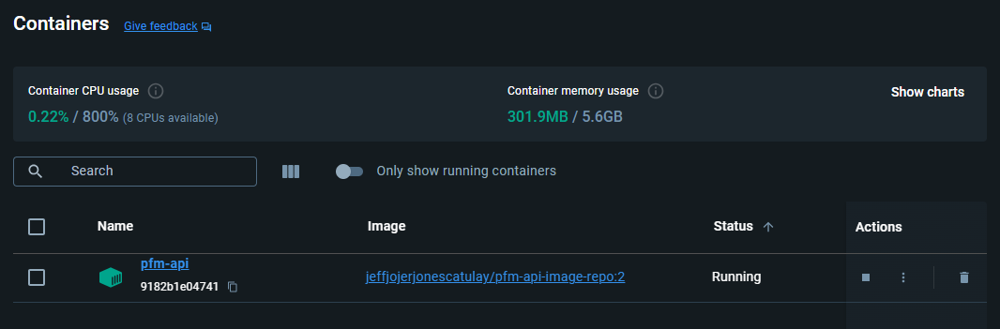
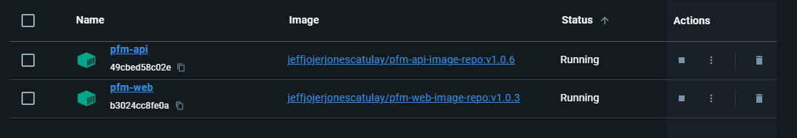

# Personal Finance Manager – Infrastructure

This repository contains the **infrastructure-related files** for the Personal Finance Manager project.  
It provides the configuration and automation needed to build, test, and deploy the system consistently across environments.

⚠️ **Note:** This is a **work in progress** and part of the larger Personal Finance Manager ecosystem.  
It serves as the dedicated repository for infrastructure, CI/CD, and containerization.

## Overview

The infrastructure module is designed to:

- 🐳 **Containerization** – Dockerfiles for building and running services in isolated environments
- 🔄 **CI/CD Pipelines** – Jenkins pipeline scripts for automated builds, tests, and deployments
- ⚙️ **Configuration Management** – Environment setup and reusable scripts
- 📦 **Deployment Support** – Ensures smooth integration across modules (API, database, frontend)

## Structure

- **Dockerfiles** – Service-level container definitions
- **Jenkins Pipelines** – CI/CD automation scripts
- **Configs** – Environment variables and reusable settings
- **Scripts** – Utility scripts for setup and deployment

- **Jenkins**
  Note: Since Github don't allow localhost webhook the build needs to be triggered manually but the rest will be automated.
  
  

- **Docker Hub**
  Once the Jenkins build was successfully the image will be pushed on a private repository on Docker Hub.
  
  

- **Docker Container**
  The image will then be pulled and deployed on a local container.
  
  
